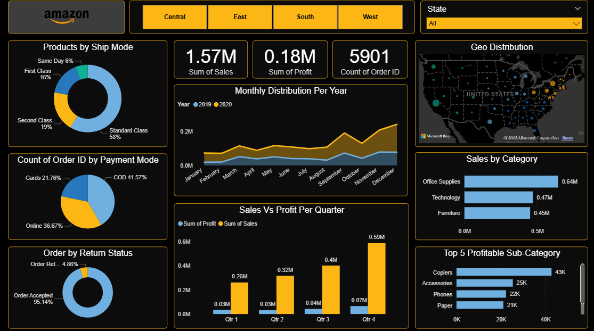

# 📦 Amazon Sales Data Analysis Dashboard

### 📊 Project Overview
This project showcases an interactive **Power BI Dashboard** built to analyze **Amazon Sales Data** across multiple regions, product categories, ship modes, payment modes, and customer behavior metrics.  
The goal of this dashboard is to provide clear insights into **sales trends, profit patterns, geographic distribution, and top-performing product segments**.

---

### ⚙️ Technologies Used
- **Power BI** — Dashboard design, modelling, and DAX calculations  
- **Microsoft Excel / CSV** — Dataset preparation  
- **Power Query Editor** — Data cleaning and transformation  
- **GitHub** — Version control and project hosting  
- **Data Source:** Amazon sample sales dataset  

---

### 🎯 Key Insights
- **Total Sales:** 1.57M | **Total Profit:** 0.18M | **Total Orders:** 5901  
- Standard Class shipping accounts for **58% of all orders**  
- COD is the most used payment mode (**41%**)  
- Orders Accepted: **95%**, very low return rate  
- Steady sales growth throughout the year, with a peak in **Q4**  
- **Office Supplies**, **Technology**, and **Furniture** are the top-selling categories  
- **Copiers** and **Accessories** are the most profitable sub-categories  
- Strong geographic presence with dense sales clusters across the U.S.  

---

### 🖼️ Dashboard Overview (Image)

---

### 🎥 Dashboard Demo Video
*(Upload your dashboard demo video to GitHub or YouTube and place the link below)*  

🔗 **Dashboard Video:** *Add your video link here*

---

### 📈 Dashboard Features
- **Dynamic KPI cards** for Sales, Profit & Order Count  
- **Interactive filters** by region, category, ship mode & year  
- **Geo-distribution map** of U.S. sales  
- **Quarter-wise Sales vs Profit visual**  
- **Payment mode and return status analysis**  
- **Top 5 profitable sub-categories visualization**  
- **Monthly comparative analysis** for 2019 & 2020  

---

### 🧠 Learning Highlights
- Data shaping using **Power Query**  
- Data modeling and relationship design  
- DAX measure creation for KPIs  
- Designing dashboards with clean layout & consistent color palette  
- Understanding customer behavior, fulfillment patterns, and profitability drivers  

---

### 🙌 Credits
Special thanks to **Office Master** and **B10X** — their tutorials and guidance helped me build this dashboard.

---

### 📚 How to Use
1. Download the `Amazon_Sales_Dashboard.pbix` file from the **pbix** folder.  
2. Open it in **Power BI Desktop (latest version)**.  
3. Explore insights using the interactive filters and visuals.

---

### 📬 Contact
👤 **Pruthviraj V Mariguddi**  
📧 *pruthvirajmariguddi@gmail.com*  
🔗 **LinkedIn:** https://www.linkedin.com/in/pruthviraj-v-mariguddi-5b647228a/

